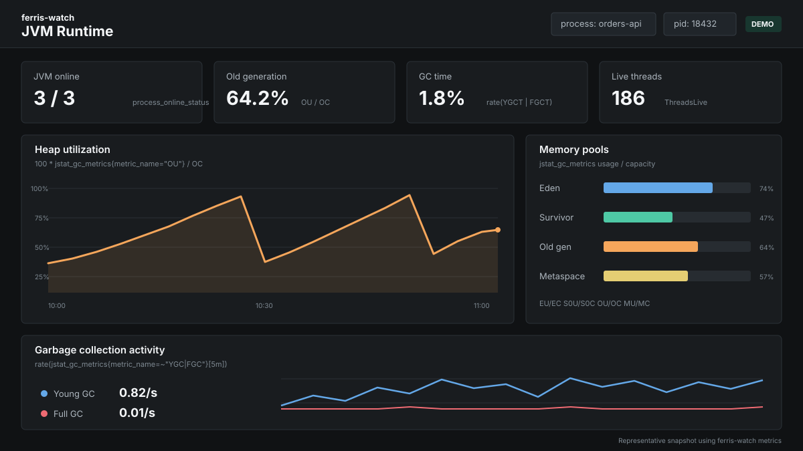
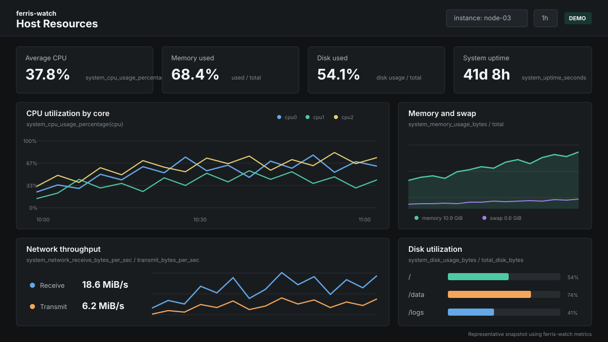
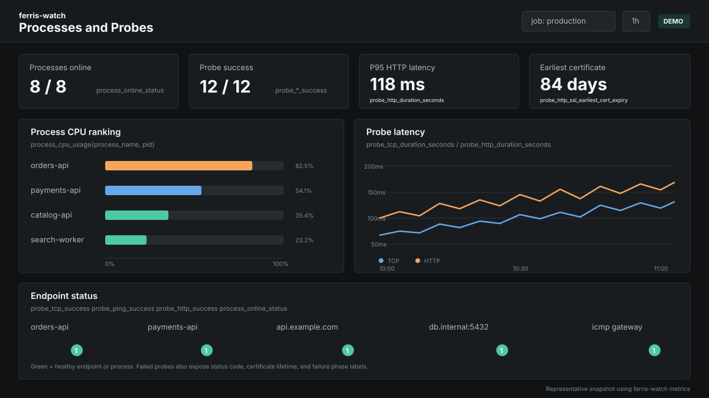

# ferris-watch

`ferris-watch` is a standalone Prometheus exporter for JVM, process, and host
metrics. It discovers Java processes on the host and reads HotSpot PerfData
without adding a Java agent or changing application startup parameters. It can
also monitor selected non-Java processes, container JVMs, host resources, and
TCP, ICMP, and HTTP probe targets.

The exporter listens on `0.0.0.0:29090` and exposes metrics at
`http://localhost:29090/metrics`.

## Highlights

- Discovers all accessible host JVMs with `jmon-rs`.
- Reuses one checked JVM monitor per PID and detects process exit or PID reuse.
- Collects JVM GC, class loading, compiler, thread, code cache, and safepoint data.
- Supports Docker and CRI containers when `jps` and `jstat` are available inside them.
- Collects CPU, memory, uptime, file descriptor, disk, network, and TCP metrics.
- Monitors additional system processes selected with regular expressions.
- Includes ready-to-import Grafana dashboards for node detail and fleet views.
- Supports local YAML configuration and optional remote configuration merging.

## How It Works

```text
JVM PerfData / jstat   /proc and OS APIs   probe targets
         |                    |                  |
         +--------------------+------------------+
                              |
                         ferris-watch
                              |
                       /metrics :29090
                              |
                         Prometheus
                              |
                           Grafana
```

Host JVM collection uses memory-mapped HotSpot PerfData. Container JVM
collection executes `jps` and `jstat` through Docker or `crictl`. Non-Java and
host metrics are collected with OS APIs and `sysinfo`.

## Requirements

- Linux, macOS, or Windows.
- Access to the target processes and their HotSpot PerfData files.
- On Linux, permission to read the relevant `/proc/<pid>` entries.
- For container JVM metrics, Docker or `crictl` plus a JDK containing `jps` and
  `jstat` inside the target container.
- Rust and Cargo are required only when building from source.

Run the exporter as a user that can inspect the target JVMs. Different Unix
users can be restricted from reading each other's `/proc` and `hsperfdata`
files.

## Build

```bash
git clone https://github.com/tf1997/ferris-watch.git
cd ferris-watch
cargo build --release
./target/release/ferris-watch --no-ui
```

Release binaries can also be downloaded from the project's
[GitHub Releases](https://github.com/tf1997/ferris-watch/releases) page.

## Configuration

At startup, ferris-watch logs the exact path of the active `config.yaml`. The
default application data directory is resolved by the operating system:

| Platform | Typical location |
| --- | --- |
| Linux | `$XDG_DATA_HOME/ferris-watch/config.yaml` or `~/.local/share/ferris-watch/config.yaml` |
| macOS | `~/Library/Application Support/ferris-watch/config.yaml` |
| Windows | `%PROGRAMDATA%\ferris-watch\config.yaml` |

The exporter starts with defaults when the file does not exist.

```yaml
log_level: info
java_home: /usr/lib/jvm/java-17
configuration_service_url:
update_service_url:
detect_java_processes: true
detect_docker_processes: false
system_processes:
  - '^nginx$'
  - 'postgres'
```

| Option | Description | Default |
| --- | --- | --- |
| `log_level` | `error`, `warn`, `info`, `debug`, or `trace` | `info` |
| `java_home` | Java home used by container `jstat` commands | Environment/default PATH |
| `detect_java_processes` | Discover and collect host JVMs | `true` |
| `detect_docker_processes` | Discover JVMs in Docker or CRI containers | `false` |
| `system_processes` | Regular expressions matched against process names | Empty |
| `configuration_service_url` | Optional remote YAML configuration endpoint | Empty |
| `update_service_url` | Optional application update endpoint | Empty |

`system_processes` entries are Rust regular expressions, not shell globs. For
example, use `.*java.*` rather than `*java*`.

Remote configuration can update most settings. Local and remote
`system_processes` entries are merged.

## Command Line

```text
--java-home <JAVA_HOME>   Set a custom Java home
--full-path               Keep the full Java main class/package path
--auto-start              Enable OS auto-start
--disable-auto-start      Disable OS auto-start
--no-ui                   Run without the desktop UI on Windows and macOS
```

On Linux, the server starts directly. On Windows and macOS, use `--no-ui` for a
headless exporter process.

## Prometheus

Example scrape configuration:

```yaml
scrape_configs:
  - job_name: ferris-watch
    scrape_interval: 60s
    scrape_timeout: 35s
    static_configs:
      - targets:
          - 127.0.0.1:29090
```

Verify the target before opening Grafana:

```bash
curl -fsS http://127.0.0.1:29090/metrics | head
```

Concurrent scrapes use the most recently collected values while another full
collection is running. A full collection has a 30-second application timeout.

## Grafana Dashboards

The repository includes two dashboards that can be imported directly into
Grafana 10 or later:

| Dashboard | File | Purpose |
| --- | --- | --- |
| Node Detail | [`grafana/ferris-watch-dashboard.json`](grafana/ferris-watch-dashboard.json) | Deep inspection of one Prometheus job and instance |
| Fleet Overview | [`grafana/ferris-watch-fleet-dashboard.json`](grafana/ferris-watch-fleet-dashboard.json) | Comparison and health overview across all selected nodes |

### Dashboard Previews

The following representative snapshots use metric families and query semantics
from the included dashboards. Values are example data for presentation rather
than a production capture.

**JVM runtime** - heap pools, GC activity, threads, and JVM availability.

[](grafana/ferris-watch-dashboard.json)

**Host resources** - CPU, memory, swap, disk, uptime, and network throughput.

[](grafana/ferris-watch-dashboard.json)

**Processes and probes** - process resource usage plus TCP, ICMP, HTTP, and TLS
health.

[](grafana/ferris-watch-fleet-dashboard.json)

1. Add Prometheus as a Grafana datasource.
2. Open **Dashboards > New > Import**.
3. Upload either dashboard JSON file. Repeat the import for the second file.
4. Select the Prometheus datasource when prompted.

The **Node Detail** dashboard uses single-select job and instance filters, plus
container, process, PID, network interface, and disk filters. It includes:

- service availability and host resource overview;
- per-process CPU, memory, lifecycle, TCP, and file descriptor utilization;
- JVM memory pool utilization plus raw Eden, survivor, old generation, metaspace, and compressed class usage and capacity;
- cumulative and per-second GC counts, cumulative GC time, and GC time percentage;
- JVM threads, code cache size and utilization, safepoints, application time, and runtime counters;
- class counts, class bytes, class loading time, JIT counters, and JIT compilation time;
- per-core CPU, memory, swap, disk, network, TCP state, and SMART panels;
- network, operating system, and exporter inventory;
- TCP, ICMP, and HTTP probe health, latency, status, certificate, and failure-phase panels.

The Node Detail `Process` and `PID` filters are multi-select and include an
`All` option. Every JVM detail query applies both filters, and each legend
includes the process name and PID so several JVMs can be compared without
merging their series. The JVM detail rows expose every `metric_name` currently
produced by the GC, class, compiler, and runtime collectors.

The **Fleet Overview** dashboard defaults to all jobs and instances. It keeps
the `instance` label in aggregate queries and uses Top 10 views for
high-cardinality process data. It includes:

- monitored node, service, JVM, and probe status summaries;
- live anomaly tables identifying affected nodes, services, processes, disks, and probe targets;
- CPU, memory, swap, disk, file descriptor, uptime, network, and TCP comparisons by node;
- process CPU, memory, uptime, TCP state, and file descriptor rankings;
- fleet-wide JVM overview plus complete memory pool, GC, runtime, class, and compiler detail rows;
- probe comparisons and node, exporter, disk, and network interface inventory.

The fleet anomaly tables always show the affected labels and current value, not
only a count. They include offline services, failed probes, unexpected HTTP
status codes, certificates with less than seven days remaining, SMART failures,
and resource thresholds. Default warning thresholds are 85% CPU, 90% memory,
85% swap, 90% disk, and 80% file descriptor utilization. JVM and process
thresholds are 80% process CPU, 20% process memory, 80% process file
descriptors, 85% old generation utilization, 10% GC time, and 10% safepoint
overhead; active JIT failures are also listed.

Fleet JVM panels expose the same GC, class, compiler, and runtime fields as the
Node Detail dashboard. Their legends retain instance, process name, and PID.
The fleet `JVM PID` filter supports multiple selections, while `JVM Top N` controls
the number of process-level series shown per detailed metric (`5`, `10`, `20`,
or `50`, default `10`) so broad node selections remain readable.

## Metrics

Prometheus adds the configured `job` and `instance` labels. Process metrics
normally include `container`, `pid`, and `process_name`. JVM metric families
also include `metric_name`.

### JVM Metrics

| Metric | `metric_name` values | Description |
| --- | --- | --- |
| `jstat_gc_metrics` | `S0C`, `S1C`, `S0U`, `S1U`, `EC`, `EU`, `OC`, `OU`, `MC`, `MU`, `CCSC`, `CCSU` | JVM memory pool capacity and usage in KB |
| `jstat_gc_metrics` | `YGC`, `FGC`, `CGC` | Collector invocation counters |
| `jstat_gc_metrics` | `YGCT`, `FGCT`, `CGCT`, `GCT` | Collector and total GC time in seconds |
| `jstat_class_metrics` | `Loaded`, `BytesLoaded`, `Unloaded`, `BytesUnloaded`, `Time` | Class loading counters, KB, and elapsed seconds |
| `jstat_compiler_metrics` | `Compiled`, `Failed`, `Invalid`, `Time` | JIT compilation counters and elapsed seconds |
| `jstat_runtime_metrics` | `ThreadsLive`, `ThreadsDaemon`, `ThreadsPeak` | JVM thread counts |
| `jstat_runtime_metrics` | `CodeCacheUsed`, `CodeCacheCapacity`, `CodeCacheUtilization` | Code cache KB and utilization ratio |
| `jstat_runtime_metrics` | `Safepoints`, `SafepointTimeSeconds`, `SafepointOverhead`, `AppTimeSenconds` | Safepoint and application runtime data |

The collector slots behind `YGC`, `FGC`, and `CGC` are JVM and garbage
collector dependent. They retain jstat-compatible names for compatibility.
`CodeCacheUtilization` and `SafepointOverhead` are ratios from `0` to `1`.

Host JVMs expose all four families through `jmon-rs`. Container JVMs expose
the supported `jstat` families available inside the container.

### Process Metrics

| Metric | Description |
| --- | --- |
| `process_online_status` | Process availability, where `1` is online and `0` is offline |
| `process_cpu_usage` | Process CPU usage percentage |
| `process_memory_usage_bytes` | Process resident memory in bytes |
| `process_memory_usage_percentage` | Percentage of host memory used by the process |
| `process_start_time_seconds` | Unix process start timestamp |
| `process_up_time_seconds` | Process uptime in seconds |
| `process_open_file` | Open file descriptor count |
| `process_open_file_limit` | File descriptor limit |
| `process_tcp_connection_states` | TCP connection count by `state` |

### Host Metrics

| Metric | Description |
| --- | --- |
| `system_cpu_usage_percentage` | CPU usage by logical CPU |
| `system_memory_usage_bytes` | Used host memory |
| `system_total_memory_bytes` | Total host memory |
| `system_swap_usage_bytes` | Used swap |
| `system_total_swap_bytes` | Total swap |
| `system_disk_usage_bytes` | Used disk space by disk and mount point |
| `system_total_disk_bytes` | Total disk space by disk and mount point |
| `system_disk_smart_health_status` | Windows disk SMART status |
| `system_network_receive_bytes_per_sec` | Receive throughput by interface |
| `system_network_transmit_bytes_per_sec` | Transmit throughput by interface |
| `system_network_receive_bytes_total` | Total received bytes by interface |
| `system_network_transmit_bytes_total` | Total transmitted bytes by interface |
| `system_network_link_speed` | Interface link speed in Mbps |
| `system_network_interface_info` | Interface metadata and addresses |
| `system_open_file` | System open file count |
| `system_open_file_limit` | System open file limit |
| `system_tcp_connection_states` | Host TCP connection count by `state` |
| `system_uptime_seconds` | Host uptime |
| `os_version_info` | OS type, release, version, and architecture |
| `ferris_watch_version` | Exporter version information |

### Probe Metrics

| Metric | Description |
| --- | --- |
| `probe_tcp_success` | TCP probe success status |
| `probe_tcp_duration_seconds` | TCP connection duration |
| `probe_ping_success` | ICMP ping success status |
| `probe_ping_duration_seconds` | ICMP ping duration |
| `probe_http_success` | HTTP probe success status |
| `probe_http_duration_seconds` | HTTP probe duration |
| `probe_http_status_code` | HTTP response status code |
| `probe_http_ssl_earliest_cert_expiry` | Remaining certificate lifetime in seconds |
| `probe_http_phase_failures_total` | HTTP failures by phase |

Probe examples:

```bash
curl 'http://127.0.0.1:29090/probe?module=tcp&target=example.com:443'
curl 'http://127.0.0.1:29090/probe?module=ping&target=1.1.1.1'
curl 'http://127.0.0.1:29090/probe?module=http&target=https://example.com'
```

## PromQL Examples

Old generation utilization percentage:

```promql
100 * jstat_gc_metrics{metric_name="OU"}
  / ignoring(metric_name)
    clamp_min(jstat_gc_metrics{metric_name="OC"}, 1)
```

GC events per second:

```promql
rate(jstat_gc_metrics{metric_name=~"YGC|FGC|CGC"}[5m])
```

Percentage of time spent in GC:

```promql
100 * rate(jstat_gc_metrics{metric_name=~"YGCT|FGCT|CGCT"}[5m])
```

Process file descriptor utilization:

```promql
100 * process_open_file / clamp_min(process_open_file_limit, 1)
```

Host memory utilization:

```promql
100 * sum(system_memory_usage_bytes) / sum(system_total_memory_bytes)
```

## HTTP Endpoints

| Endpoint | Description |
| --- | --- |
| `GET /metrics` | Collect and expose Prometheus metrics |
| `GET /config` | Return the active configuration |
| `POST /config` | Replace the in-memory configuration |
| `GET /probe?module=<module>&target=<target>` | Run a TCP, ping, or HTTP probe |

## Troubleshooting

### A host JVM is missing

Confirm that the exporter user can read `/proc/<pid>` and the JVM's
`hsperfdata` file. On Linux, also check `hidepid` mount options and service
sandboxing restrictions.

### Container JVM metrics are missing

Enable `detect_docker_processes`, verify that Docker or `crictl` is available,
and confirm that `jps` and `jstat` exist inside the container.

### Prometheus scrapes time out

Avoid multiple Prometheus jobs scraping the same exporter at a high frequency.
Check exporter logs for JVM discovery, socket collection, permissions, and
container command failures.

### Metrics disappear after a JVM restart

JVM series include the PID. A restarted JVM receives a new series, while the
old PID's metrics are removed. Select the new PID in Grafana or use queries that
aggregate by `process_name`.

## License

Licensed under the Apache License 2.0. See [LICENSE](LICENSE).
